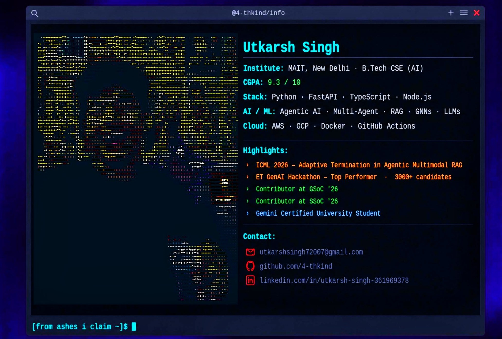

  

 

  

 

## 📌 Featured Projects

<table width="100%" cellspacing="10" cellpadding="0" border="0">
  <tr>
    <td width="50%" style="padding:8px;">
      <a href="https://github.com/4-thkind/GenAI-ET-hackathon" style="text-decoration:none;">
        <table width="100%" style="background:#ffb6c1; border-radius:12px; padding:20px;">
          <tr><td align="center">
            <b style="font-size:16px;">⚡ GenAI-ET-hackathon</b>  
            <i>An autonomous multi-agent system that takes ownership of complex, multi-step enterprise code review and remediation processes</i>  
            
          </td></tr>
        </table>
      </a>
    </td>
    <td width="50%" style="padding:8px;">
      <a href="https://github.com/4-thkind/Movie-Recommendation-Model" style="text-decoration:none;">
        <table width="100%" style="background:#ffb6c1; border-radius:12px; padding:20px;">
          <tr><td align="center">
            <b style="font-size:16px;">🎬 Movie-Recommendation-Model</b>  
            <i>Replace old school methods to Get recommendation; try MRM</i>  
            
          </td></tr>
        </table>
      </a>
    </td>
  </tr>
  <tr>
    <td width="50%" style="padding:8px;">
      <a href="https://github.com/4-thkind/Careflow" style="text-decoration:none;">
        <table width="100%" style="background:#ffb6c1; border-radius:12px; padding:20px;">
          <tr><td align="center">
            <b style="font-size:16px;">💪 Careflow</b>  
            <i>An app that Tracks your fitness along with life style</i>  
            
          </td></tr>
        </table>
      </a>
    </td>
    <td width="50%" style="padding:8px;">
      <a href="https://github.com/4-thkind/MyNewsApp" style="text-decoration:none;">
        <table width="100%" style="background:#ffb6c1; border-radius:12px; padding:20px;">
          <tr><td align="center">
            <b style="font-size:16px;">📰 MyNewsApp</b>  
            <i>Catch News Flying Around You</i>  
            
          </td></tr>
        </table>
      </a>
    </td>
  </tr>
</table>